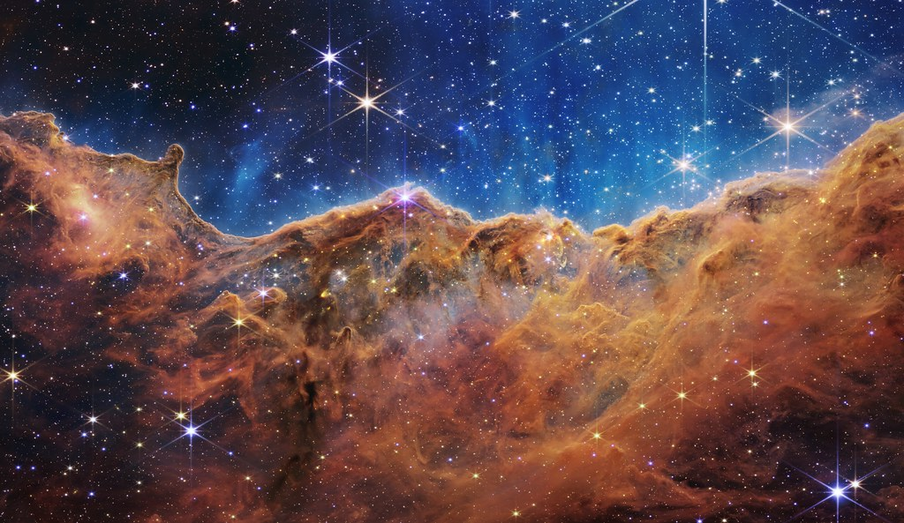

<p align="center">
    
</p>

<div align="center">

  <a style="margin-right:15px" href="#"></a>
  <a style="margin-right:15px" href="#"></a>  
  <a href="#"></a>  


  <a href="https://opensource.org/licenses/MIT"></a>
  <a href="https://en.cppreference.com/w/"></a>

</div>


# Nebula

Project heavily in progress.

## Overview

C++ 17 game engine. 

- 2D & 3D support
- OpenGL and Vulkan
- Multithreading
- Memory optimized
- ECS
- Animations
- Editor
- Physics
- Sound
- Fonts
- Networking
- Go scripting
- Native Serialization

## Prerequisites

Project is currently oriented towards building on MacOSX.  

It requires a C++17 and Jemalloc present in system if linking to it. You may build and install Jemalloc from its official repo.

## Build & Run

Generate the Cmake build files and use Ninja generator (optional).  

`cmake -S . -B build -DCMAKE_BUILD_TYPE=Release -G Ninja`  

You may pass additional build args like so: `-DNEBULA_JEMALLOC=1`  

Build with:  

```
cd build
ninja nebula_sandbox
```  

Binary built will be at build/sandbox.  
For running, it needs the sandbox/res alongside the binary, or use sandbox/ as the working dir.